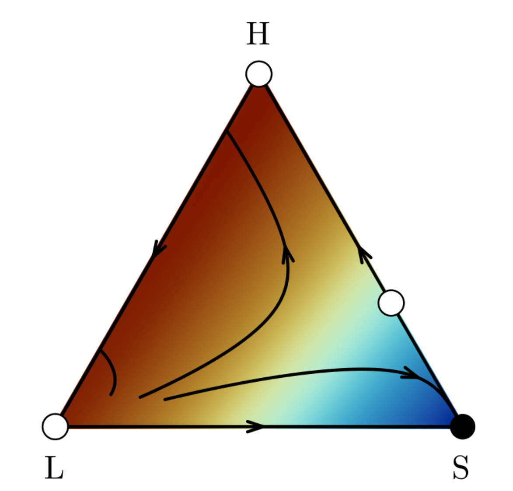
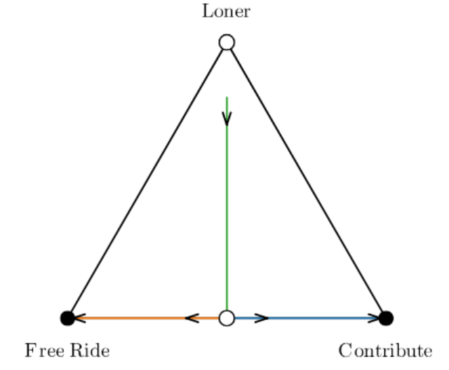

# BaryPlots.jl



BaryPlots is a Julia package designed to visualize the evolutionary dynamics of strategies in population games, inspired by Richard McElreath's [baryplot R package](https://github.com/rmcelreath/baryplot). It provides tools for plotting trajectories on a ternary simplex, determining equilibria, and visualizing payoff landscapes using contour plots.

### Installation

To install BaryPlots, simply add the package from your local environment or by cloning the repository:

```julia

] add BaryPlots

```

or clone into the repository:

```julia

] add https://github.com/datadreamscorp/BaryPlots.jl

```

### Overview

BaryPlots focuses on simulating and visualizing the evolution of strategy frequencies over time in evolutionary games. The core of the package is the plot_evolution function, which allows you to simulate population dynamics under various payoff structures and plot the results in a visually clear format, including contour plots to visualize the payoff landscape.

#### The `plot_evolution` Function

The `plot_evolution` function simulates and plots the evolution of strategy frequencies over time using replicator dynamics. This function is especially useful in evolutionary game theory to track how different strategies fare in a population.

```julia

plot_evolution(
        payoff_functions::Tuple{Function, Function, Function},
        x0_list::Vector{<:AbstractVector{<:Real}},
        tspan::Tuple{Float64, Float64};
        labels::Vector{String} = ["Strategy 1", "Strategy 2", "Strategy 3"],
        extra_params::NamedTuple = NamedTuple(),
        steady_state_tol::Float64 = 1e-6,
        arrow_list::Vector{Vector{Int}} = Vector{Vector{Int}}(),
        trajectory_labels::Vector{String} = String[],
        trajectory_colors::AbstractVector = Any[],
        trajectory_linewidth::Int = 2,
        num_initial_guesses::Int = 1000,
        solver_tol::Float64 = 1e-8,
        equilibrium_tol::Float64 = 1e-5,
        validity_tol::Float64 = 1e-6,
        stability_tol::Float64 = 1e-6,
        markersize::Int = 9,
        markerstrokewidth::Int = 2,
        colored_trajectories::Bool = false,
        contour::Bool = false,
        contour_color::Symbol = :roma,
        contour_resolution::Int = 150,
        contour_levels::Int = 10,
        colorbar::Bool = false,
        triangle_linewidth::Int = 2,
        legend::Bool = false,
        margin::Int = 2,
        dpi::Int = 300,
    )::Plots.Plot

```
    Parameters:

    payoff_functions: A tuple of three payoff functions corresponding to each strategy.

    x0_list: A vector of initial conditions (strategy frequencies) to simulate trajectories.
    
    tspan: A tuple representing the time span for the simulation, e.g., (0.0, 1000.0).
    
    labels: Labels for the corners of the simplex. Default is ["Strategy 1", "Strategy 2", "Strategy 3"].
    
    extra_params: A NamedTuple that can pass extra parameters to the payoff functions.
    
    steady_state_tol: The tolerance level for determining when a trajectory reaches steady state.
    
    arrow_list: A list of indices to draw arrows along the trajectory, useful for indicating the direction of change.
    
    trajectory_labels: Labels for each trajectory. Defaults to a numbered list.
    
    trajectory_colors: Colors for each trajectory. If colored_trajectories is false (default), all trajectories will be black.
    
    trajectory_linewidth: Line width for the trajectory lines.
    
    num_initial_guesses: Number of initial guesses to use when finding equilibria.
    
    solver_tol: Tolerance for the numerical solver when finding equilibria.
    
    equilibrium_tol: Tolerance for determining when a point is an equilibrium.
    
    validity_tol: Tolerance for validating equilibrium points within the simplex.
    
    stability_tol: Tolerance for stability analysis of equilibria.
    
    markersize: Size of equilibrium markers.
    
    markerstrokewidth: Stroke width of the equilibrium marker boundary.
    
    colored_trajectories: Boolean flag indicating whether to color the trajectories or keep them black.
    
    contour: Boolean flag to include a filled contour plot of the average payoffs over the simplex.
    
    contour_resolution: Resolution of the contour plot grid.
    
    contour_levels: Number of contour levels in the contour plot.
    
    cbar: Boolean flag to include a color bar in the contour plot.
    
    triangle_linewidth: Line width for the simplex triangle.
    
    legend: Boolean flag to include a legend.
    
    margin: Margin to exclude points near the boundaries in the contour plot.
    
    dpi: Dots per inch for the plot resolution.
    
    payoff_functions: A tuple of three payoff functions corresponding to each strategy.


### Example 1: Basic Hawk-Dove Dynamics


In this example, we simulate the Hawk-Dove game and include a contour plot to visualize the average payoff landscape over the simplex.

```julia

using BaryPlots, LaTeXStrings

# Payoff functions for Hawk-Dove game
function hd_payoff_H(x, t, params)
    H, D = x[1], x[2]
    return (-1) * H + 4 * D  # Payoff for Hawk
end

function hd_payoff_D(x, t, params)
    H, D = x[1], x[2]
    return 0 * H + 2 * D  # Payoff for Dove
end

function hd_payoff_dummy(x, t, params)
    return 0.0  # Dummy payoff function for the third strategy
end

```

#### Simulate and plot the evolution

```julia

payoff_functions = (
    hd_payoff_H, 
    hd_payoff_D, 
    hd_payoff_dummy
    )

initial_conditions = [
        [0.99, 0.01, 0.0], 
        [0.01, 0.99, 0.0]
        ]# Two starting points

# Simulate and plot
p = plot_evolution(
    payoff_functions,
    initial_conditions,
    (0.0, 100.0);
    labels = [L"\mathrm{Hawk", L"\mathrm{Dove}", L"\mathrm{Loner}"],
    arrow_list = [ [300], [300] ],
    contour = true,              # Include contour plot
)

display(p)
```

This code simulates the evolution of the Hawk-Dove game starting from two different initial conditions. The strategies "Hawk" and "Dove" evolve over time, and the dynamics are plotted on a simplex with a contour plot showing the average payoff landscape. The contour plot helps visualize regions of high and low average payoffs, providing deeper insight into the dynamics.


### Example 2: Rock-Paper-Scissors Game


In this example, we simulate the evolution of strategies in the Rock-Paper-Scissors game, where each strategy cyclically dominates another.

```julia

# Payoff for Rock (R)
function rps_payoff_R(x, t, params)
    R, P, S = x[1], x[2], x[3]
    return 0 * R + 1 * S - 1 * P  # Rock beats Scissors
end

# Payoff for Paper (P)
function rps_payoff_P(x, t, params)
    R, P, S = x[1], x[2], x[3]
    return 0 * P + 1 * R - 1 * S # Paper beats Rock
end

# Payoff for Scissors (S)
function rps_payoff_S(x, t, params)
    R, P, S = x[1], x[2], x[3]
    return 0 * S + 1 * P - 1 * R  # Scissors beat Paper
end

# Initial conditions
initial_conditions = [
    [0.6, 0.3, 0.1], 
    [0.2, 0.4, 0.4]
    ]
	
# Simulate and plot
plot_evolution(
    (rps_payoff_R, rps_payoff_P, rps_payoff_S),
    initial_conditions,
    (0.0, 100.0),
    labels=[L"\mathrm{Rock}", L"\mathrm{Paper}", L"\mathrm{Scissors}"],
    arrow_list = [ [100], [100] ],
    colored_trajectories = true
)

```

The cyclic nature of the Rock-Paper-Scissors game is shown as each strategy's population evolves over time. The trajectories are optionally colored to make the different dynamics stand out.


### Example 3: Parameterized Game - Public Goods Game with Diminished Free-Rider Returns



In this example, we explore a parameterized version of the Public Goods Game, where the payoff for contributing depends on a benefit multiplier, `b`. Free Riders only get half of the benefit during interactions, potentially decreasing the incentive for free riding depending on the size of `b`. We can vary `b` to examine how it impacts the dynamics of contribution and free-riding in the population.

#### Defining the Parameterized Game

```julia

# Define the payoffs for Contribute (C) and Free Ride (F)
function pg_payoff_C(x, t, params)
    b = params.b
    C = x[1]
    F = x[2]
    return b * C + 0 * F
end

function pg_payoff_F(x, t, params)
    b = params.b
    C = x[1]
    F = x[2]
    return (b/2) * C + 1 * F
end

function pg_payoff_dummy(x, t, params)
    return 0.0
end

# Set up the parameterized game with benefit multiplier b = 2.0
params = (b = 2.0, )
payoff_functions_PG = (pg_payoff_C, pg_payoff_F, pg_payoff_dummy)

# Initial conditions for different starting frequencies of strategies
initial_conditions_PG = [
    [0.51, 0.49, 0.0],
    [0.49, 0.51, 0.0],
	[0.1, 0.1, 0.80]
]

# Simulate and plot the dynamics
plot_evolution(
    payoff_functions_PG,
    initial_conditions_PG,
    (0.0, 100.0);
    labels = [L"\mathrm{Contribute}", L"\mathrm{Free\ Ride}", L"\mathrm{Loner}"],
    extra_params = params,
    colored_trajectories = true,
    arrow_list = [ [500, 1000], [500, 1000], [200] ],
    equilibrium_tol = 1e-3
)

```

### Customization Options

You can customize several aspects of the plot, including the colors of the trajectories, labels for each strategy, and where arrows are drawn to indicate the direction of the population's evolution.

    arrow_list: A vector specifying where arrows should be placed along the trajectory.

    trajectory_labels: Provide custom labels for the trajectories.

    trajectory_colors: Customize the colors of the trajectories.

    colored_trajectories: Set this flag to true to have different colors for each trajectory, or keep it false for black trajectories.
    
    contour: Set this flag to true to include a filled contour plot of the average payoffs over the simplex.
    
    contour_resolution: Adjust the resolution of the contour plot grid.
    
    contour_levels: Set the number of contour levels in the contour plot.
    
    colorbar: Include a color bar in the contour plot by setting this flag to true.
    
    triangle_linewidth: Adjust the line width of the simplex triangle.
    
    markersize: Set the size of equilibrium markers.
    
    markerstrokewidth: Stroke width of the equilibrium marker boundary.
    
    legend: Set to true to include a legend in the plot.

### Equilibria and Stability

The `plot_evolution` function automatically calculates the equilibria of the system and determines whether each equilibrium is stable. Stable equilibria are marked with filled black circles, while unstable equilibria are marked with hollow circles.

### License

This project is licensed under the MIT License - see the [LICENSE](./LICENSE) file for details.

### Acknowledgments

This package makes use of several outstanding Julia packages:

- **[DifferentialEquations.jl](https://github.com/SciML/DifferentialEquations.jl)**
- **[ForwardDiff.jl](https://github.com/JuliaDiff/ForwardDiff.jl)**
- **[Plots.jl](https://github.com/JuliaPlots/Plots.jl)**
- **[NLsolve.jl](https://github.com/JuliaNLSolvers/NLsolve.jl)**

These dependencies are critical to the functionality of this package, and we thank the authors for their valuable contributions.

### Citing BaryPlots

If you use `BaryPlots.jl` in your research, please cite it as:

[](https://doi.org/10.5281/zenodo.13923783)

You can also download the citation in BibTeX, RIS, or other formats from Zenodo.
